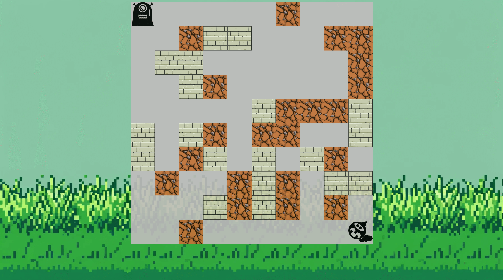

# 💣 Bomber Game

A 2D grid-based multiplayer bomber-style game. Players navigate a board, place bombs, and try to eliminate each other while avoiding obstacles and explosions.

**🔗 Live Demo**: [Bomber Game](https://dobbyssockk.github.io/bomber-game/)

---

## 🚀 Features

- Two-player gameplay on a 10×10 grid
- Bomb placement and timed explosions
- Destructible and indestructible tiles
- Randomized starting layout
- Player movement and collision detection
- Simple and clean UI with pixel-style icons

---

## 🎮 Controls

- **Player 1**:
  - Move: `W`, `A`, `S`, `D`
  - Place Bomb: `Space`
- **Player 2**:
  - Move: `Arrow Keys`
  - Place Bomb: `Enter`

---

## 🛠️ Technologies Used

- **HTML5** – layout structure for game grid and interface
- **CSS3** – grid layout styling and responsive design
- **JavaScript (Vanilla)** – core game logic: grid rendering, movement, bomb timers
- **SVG icons** – for players, bombs, explosions, and tiles

---

## 💡 Key Concepts

- **Grid-based rendering**: 1D array mapped to 2D positions
- **Game state management**: tracking player positions, bombs, and explosion logic
- **Keyboard event handling**: WASD / arrow keys and bomb actions
- **DOM manipulation**: real-time rendering of grid changes and animations
- **Collision logic**: between players, bombs, and tiles
